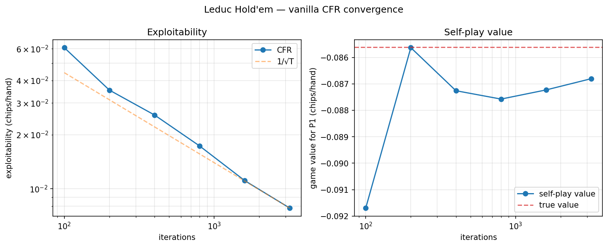

# Leduc-Poker-Bot
An implementation of counterfactual regret minimisation to compute strategies/Nash equilibrium/game value for Kuhn and Leduc Poker

# Explanation of variants
Kuhn poker has a deck of 3 cards (J, Q, K), 1 betting round with no raises and a showdown for the highest card.
Leduc poker has a deck of 6 cards, 2 x (J, Q, K), 2 betting rounds with 2 bet maximum per round, and a showdown with a community card flopped after the first round to determine the winner (pair beats high card etc.).

# Files
kuhnplay.py and leducplay.py will simulate a random game of each variant of poker, respectively
kuhnsolve.py and leducsolve.py both use counterfactual minimisation to calculate strategies in alignment with Nash equilibrium for the respective variants of poker, as well as game value

# Validation
The true game value for Leduc under this parameterisation (ante 1, bets of 2 and 4,
two-bet maximum per round) is -0.085606, computed by sequence-form linear programming.
The solver also finds exactly 288 information sets, matching the published count.

Exploitability is the gain a best-responding opponent could make against the average
strategy, averaged over both players. It falls monotonically to zero at equilibrium,
which the self-play game value does not — note it wanders either side of the target
while exploitability decreases at every checkpoint.

| Iterations | Game value | Exploitability |
|---|---|---|
| 100 | -0.09170 | 0.06090 |
| 200 | -0.08563 | 0.03538 |
| 400 | -0.08726 | 0.02573 |
| 800 | -0.08757 | 0.01731 |
| 1600 | -0.08723 | 0.01111 |
| 3200 | -0.08680 | 0.00782 |

